# Сервис рассылок SkyChimp

## Авторизация и регистрация пользователей

1. Неавторизованный пользователь может просматривать только главную страницу и блог
   (список публикаций и детали публикации). Если неавторизованный пользователь попытается
   сделать какие-то другие действия на платформе, то произойдет перенаправление на страницу авторизации
   с сообщением

```
Необходимо авторизоваться!
```

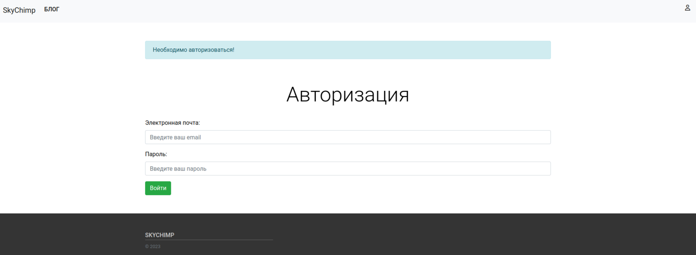

* Когда пользователь не авторизован, в правом верхнем углу навигационной панели доступно выпадающее меню с переходом
  на страницы авторизации и регистрации
  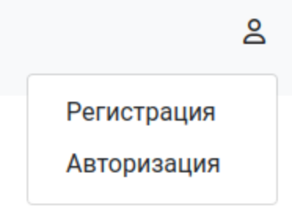

2. Для авторизации надо ввести электронную почту и пароль.

* Если будет введён адрес электронной почты, который не найден в системе, появится сообщение об ошибке
    ```
    Пользователь с таким адресом электронной почты не найден! Введите корректный адрес электронной почты 
    или пройдите регистрацию на нашем сайте, если вы здесь впервые.
    ```

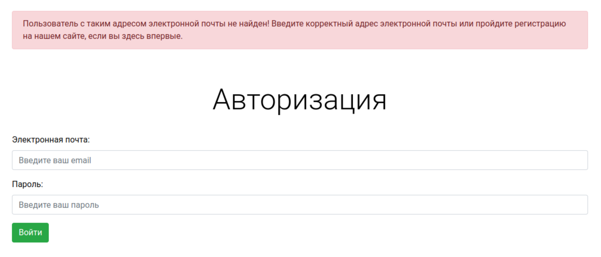

* Если будет введён некорректный пароль, появится сообщение об ошибке

```
Вы ввели неверный пароль!
```

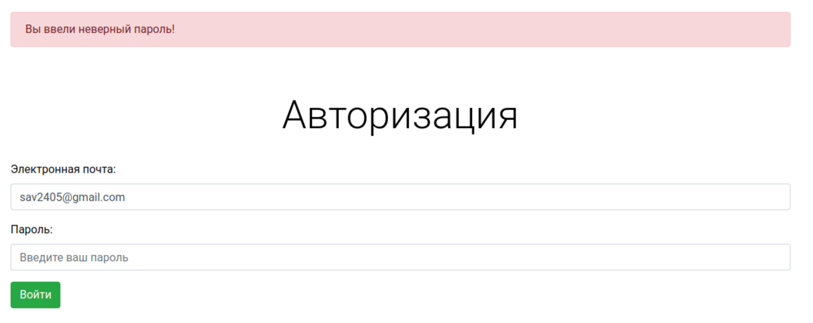

* Когда пользователь авторизован, в правом верхнем углу навигационной панели доступно выпадающее меню с
  переходом на страницу профиля и с выходом из профиля
  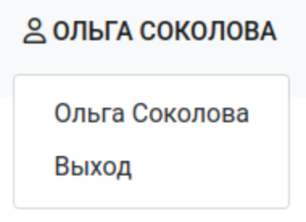

3. Для регистрации необходимо ввести электронную почту, имя, фамилию, пароль, повтор пароля.
   Поле `Отчество` является необязательным.

* Валидация формы регистрации:
    * Проверка заполнения обязательных полей
    * Проверка не зарегистрирован ли уже пользователь с таким адресом электронной почты
    * Проверка корректности адреса электронной почты
    * Проверка надежности пароля
    * Проверка совпадения введенных паролей
* Если форма заполнена верно, то на указанный адрес электронной почты высылается ссылка для подтверждения,
  происходит редирект на главную страницу сайта, и появляется сообщение

```
Спасибо за регистрацию! Вам на почту выслано письмо с подтверждением.
```

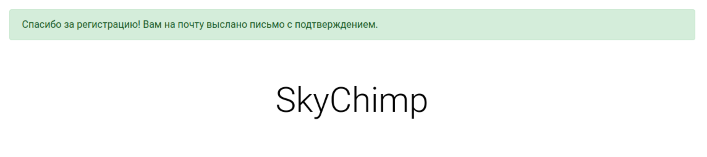

* Если попытаться авторизоваться на сервисе без подтверждения адреса электронной почты по ссылке,
  появиться сообщение

```
Ваш email не подтвержден. Пожалуйста, перейдите по ссылке, отправленной на вашу электронную почту!
```

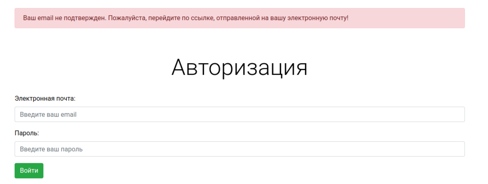

* Если перейти по некорректной ссылке, произойдет перенаправление на главную страницу сервиса, появится сообщение

```
Ваш email не подтверждён! Пожалуйста, проверьте вашу почту и следуйте инструкциям для подтверждения электронной почты.
```

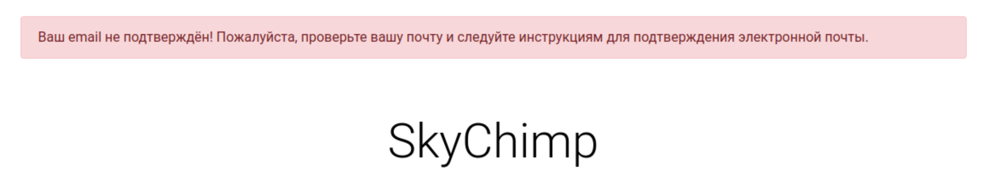

* Если перейти по корректной ссылке, отправленной на указанный адрес, то произойдет перенаправление на страницу профиля,
  появится сообщение

```
Регистрация на сайте успешно завершена!
```

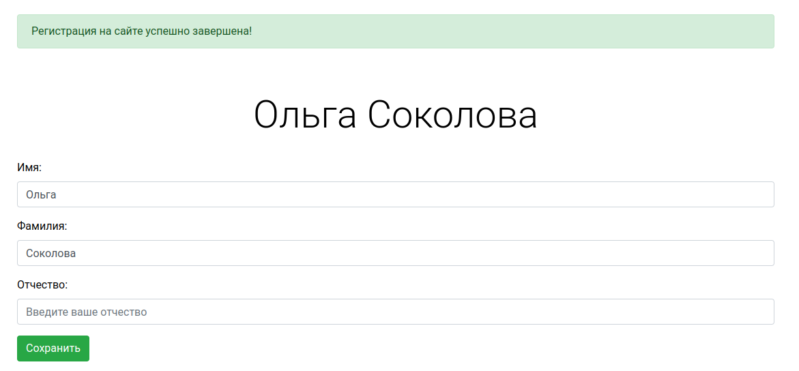

4. Для восстановления пароля необходимо нажать кнопку "Забыл пароль" на странице
   авторизации. Необходимо указать адрес электронной почты, куда будет отправлена
   ссылка на восстановление пароля.
   Если перейти по корректной ссылке, будет доступна форма установки нового пароля с
   последующей авторизацией с этим новым паролем.
   В противном случае пользователь получит сообщение

```
Ссылка для сброса пароля недействительна. Вероятно она уже была использована. 
Пожалуйста, запросите восстановление пароля еще раз.
```

## Уровни доступа

На сервисе есть три уровня доступа:

1. Администратор
2. Менеджер
3. Обычный пользователь

* Для администратора и менеджера в навигационной панели доступно меню `МЕНЕДЖМЕНТ`
* Администратор и менеджер могут просматривать список пользователей сервиса
* Администратор может блокировать пользователей и наделять пользователей правами менеджера
  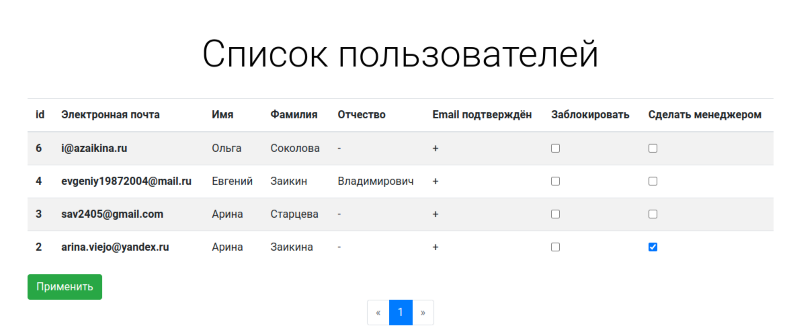
* Менеджер может блокировать пользователей
  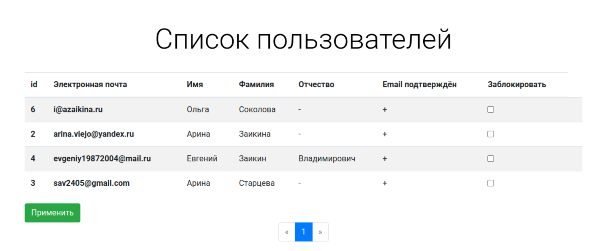
* Если неавторизованный пользователь или пользователь без прав администратора попытается
  пройти по адресу
  ```http://127.0.0.1:8000/user/user-list/```, то произойдёт перенаправление на главную страницу сайта
  с сообщением

```
У вас нет соответствующих прав доступа! 
```

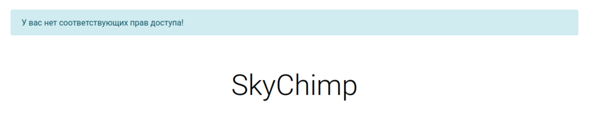

* Если пользователя заблокировали, он сможет просматривать главную страницу сайта, список публикаций и детали
  публикаций.
* Если заблокированный пользователь попытается авторизоваться на сервисе, произойдет перенаправление
  на главную страницу сервиса с сообщением

```
Вы заблокированы! Обратитесь к менеджеру или администратору. 
```

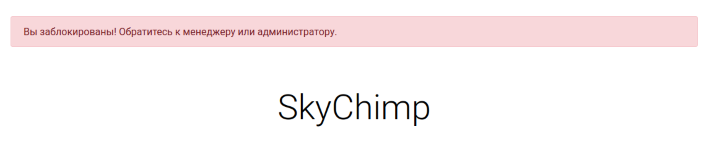

Детальное описание других прав пользователей будет описано ниже.

## Создание и редактирование публикации

1. Авторизованный на сервисе пользователь может создавать публикации.
2. Для создания статьи необходимо заполнить поля `Заголовок` и `Содержание`.
   Поле `Изобаржение` не является обязательным.
3. Автор статьи может редактировать и удалять статью. Для автора на странице статьи доступны
   кнопки `Редактировать пост` и `Удалить пост`.
4. Если другой пользователь (не автор публикации) попробует перейти по URL для редактирования или удаления
   публикации, то произойдет перенаправление на главную страницу сервиса с сообщением

```
У вас нет разрешения на редактирование и удаление этого объекта 
```

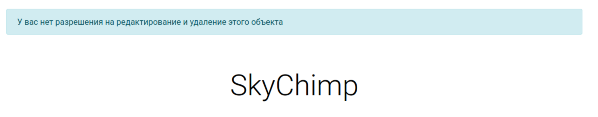

## Создание, просмотр и редактирование клиентов для рассылки писем

1. Авторизованный на сервисе пользователь может создавать, просматривать и редактировать клиентов
   для рассылки писем.
2. Для создания клиента необходимо заполнить поля `Электронная почта`, `Имя`, `Фамилия`.
   Поля `Отчество` и `Комментарий` не являются обязательными.
3. Разные пользователи сервиса могут создать клиента с такой электронной почтой, который уже есть в базе данных,
   но закреплен за другим пользователем (это корректное поведение).
   Пользователь не может создавать клиентов с одинаковыми адресами электронной почты, которые будут закреплены за ним.
   То есть на уровне пользователя клиенты должны быть с уникальным адресом электронной почты. На уровне
   всех пользователей - нет.
4. Каждый пользователь (вне зависимости от того администратор он или менеджер) видит список только своих клиентов.
   Также он может редактировать и удалять своих клиентов.
5. Если пользователь, который не создавал этого клиента, попытается отредактировать информацию по клиенту
   или удалить клиента, произойдет перенаправление на главную страницу сайта с сообщением.

```
У вас нет разрешения на редактирование и удаление этого объекта 
```

## Создание, просмотр и редактирование писем для рассылки

1. Авторизованный на сервисе пользователь может создавать, просматривать и редактировать письма для рассылки.
2. Для создания письма необходимо заполнить поля `Тема письма` и `Тело письма`.
3. Каждый пользователь (вне зависимости от того администратор он или менеджер) видит список только своих писем.
   Также он может редактировать и удалять свои письма.
4. Если пользователь, который не создавал этого письма, попытается отредактировать информацию в письме
   или удалить письмо, произойдет перенаправление на главную страницу сайта с сообщением

```
У вас нет разрешения на редактирование и удаление этого объекта 
```

## Создание, просмотр и редактирование рассылок

1. Авторизованный на сервисе пользователь может создавать, просматривать и редактировать рассылки.
2. Для создания рассылки необходимо заполнить поля `Время расылки писем`, `Дата завершения рассылки`,
   `Время завершения рассылки`, `Периодичность`, `Клиенты` и `Сообщения`. Дата завершения рассылки может быть только
   больше текущей даты. В поле `Клиенты` можно выбрать несколько клиентов (можно выбрать сразу всех).
   В поле `Сообещения` можно выбрать несколько сообщений (можно выбрать сразу все).
3. После создания рассылки создаётся периодическая задача на ее выполнение.
4. Периодические задачи хранятся в базе данных и вызываются согласно их настройке. При вызове задачи рассылки
   происходит проверка времени завершения задачи. Если время завершения задачи еще не наступило, то происходит рассылка
   писем.
   Если время завершения наступило, рассылке присваивается статус `Завершена`, а соответствующая периодическая
   задача по ее выполнению удаляется из базы данных.
5. По результатам отправки каждого письма каждому клиенту создается лог.
6. Обычный пользователь может просматривать только свой список рассылок. Менеджер и администратор
   могут просматривать список всех рассылок.
7. Редактировать рассылку может только тот пользователь, который её создал.
   На странице с детальной информацией о рассылке есть кнопка `Редактировать`.
   При попытке отредактировать рассылку пользователем,
   который не является её создателем произойдет перенаправление на главную страницу сайта с сообщением

```
У вас нет разрешения на редактирование и удаление этого объекта 
```

8. Просматривать и отключать рассылку может пользователь, который ее создал, менеджер и администратор.
   На странице с детальной информацией о рассылке есть кнопка `Отключить`.
   При попытке просмотреть или отключить рассылку по соответствующему URL другим пользователем
   произойдет перенаправление на главную страницу сайта с сообщением

```
У вас нет соответствующих прав доступа! 
```

9. Если рассылка отключена, то возможности ее отредактировать и отключить нет.
   Кнопки `Редактировать` и `Отключить` недоступны.
   При попытке это сделать по соответствующему URL
   произойдет перенаправление на страницу с детальной информацией о рассылке и сообщением

```
Рассылка #<id> отключена! 
```

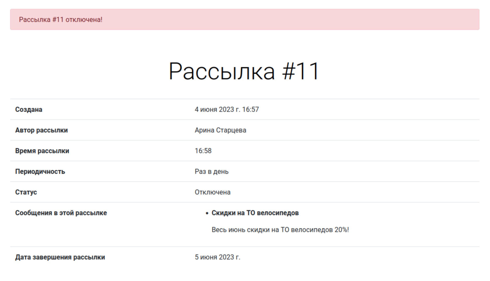

## Просмотр логов

1. Отчеты по проведенным рассылкам доступны в выпадающем меню `РАСЫЛКИ` (пункт `Отчёт по проведенным рассылкам`)
   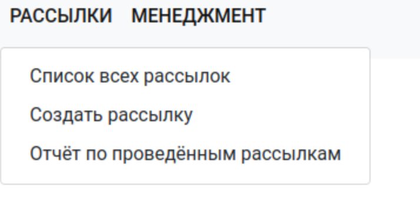
2. Администратор и менеджер могут просматривать логи всех рассылок.
3. Обычный пользователь может просматривать логи только своих рассылок.
4. Если пользователь по соответствующему URL попытается посмотреть логи рассылки, которую он
   не создавал, произойдет перенаправление на главную страницу сайта с сообщением

```
У вас нет доступа к этому логу! 
```

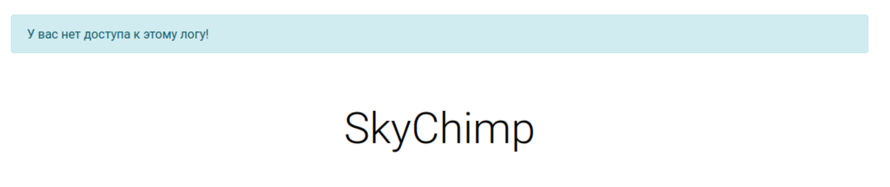

## Главная страница сервиса

На главной странице сервиса отображена следующая информация:

1. Общее количество рассылок
2. Количество активных рассылок
3. Количество уникальных клиентов.
   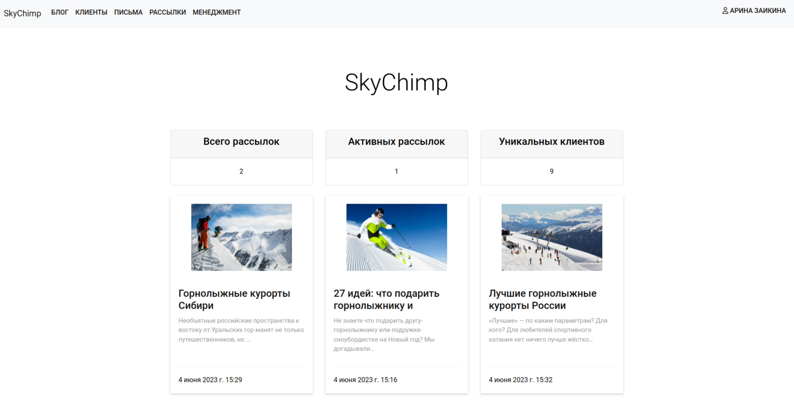


## Кеширование данных
1. На главной странице настроено низкоуровневое кеширование метрик на 2 минуты.
2. Настроено кеширование контроллера PostListView на 2 минуты
3. Настроено кеширование страницы статьи на уровне шаблона (кешируется всё на 2 минуты кроме
количества просмотров).